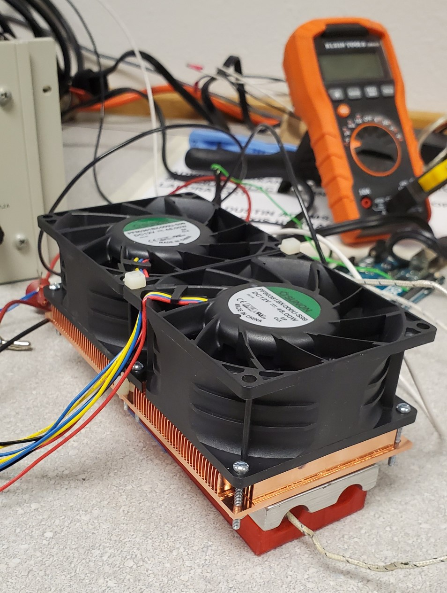
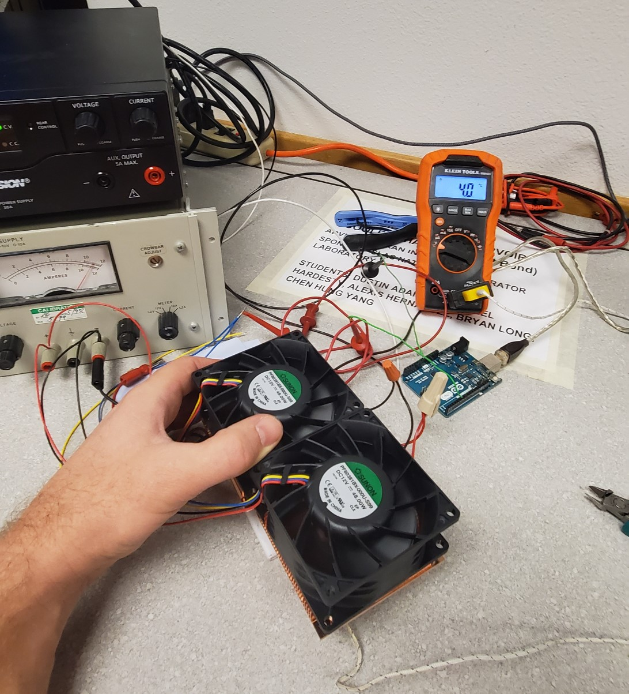
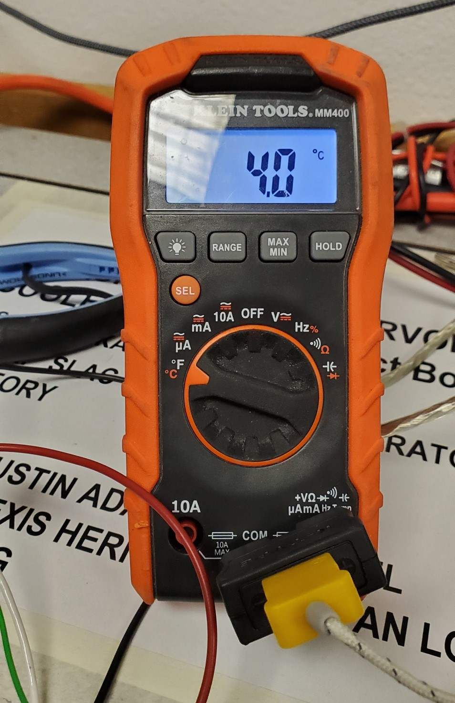
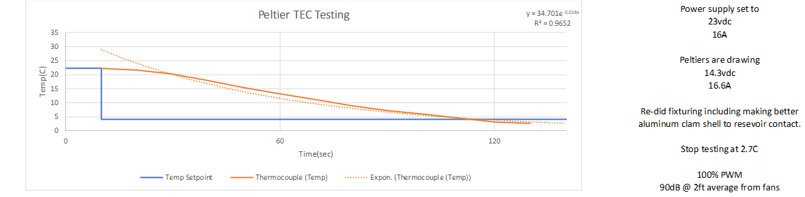

<!--
  /*
   * webpage url
   * https://mechaengbryan.github.io/MECA482-Temp_Control_Project/
   */
-->

## California State University, Chico
## Mecahanical and Mechatronic Engineering
## MECA 482 Controls - Temperature Control System Group Project Website


<!-- the below embeds an image in website -->

Testing setup

Device Under Test (DUT)

Performing Test

DMM with K-Type Thermocouple Displaying Temperature

Results Plotted with exponential curve fit

```
- this is a test
```

```markdown
Syntax highlighted code block

# Header 1
## Header 2
### Header 3

- Bulleted
- List

1. Numbered
2. List

**Bold** and _Italic_ and `Code` text

[Link](url) and 
```

```
- this is a test
```

For more details see [GitHub Flavored Markdown](https://guides.github.com/features/mastering-markdown/).

### Jekyll Themes

Your Pages site will use the layout and styles from the Jekyll theme you have selected in your [repository settings](https://github.com/MechaEngBryan/MECA482-Temp_Control_Project/settings). The name of this theme is saved in the Jekyll `_config.yml` configuration file.

### Support or Contact

Having trouble with Pages? Check out our [documentation](https://help.github.com/categories/github-pages-basics/) or [contact support](https://github.com/contact) and we’ll help you sort it out.
