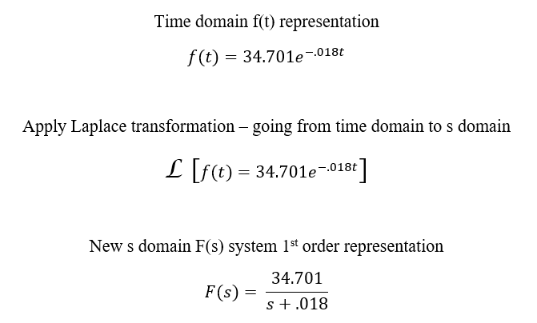
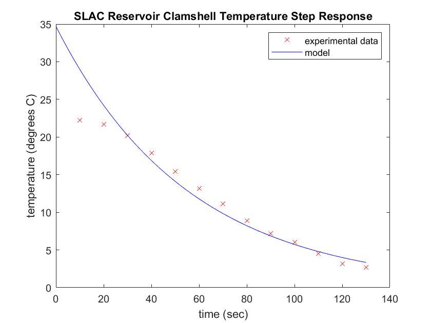

<!--
  /*
   * webpage url
   * https://mechaengbryan.github.io/MECA482-Temp_Control_Project/
   */
-->

## California State University, Chico
## Mecahanical and Mechatronic Engineering
## MECA 482 Controls - Temperature Control System - Group Project Website
## MECA 440 Engineerinig Capstone - SLAC Reservoir Cooling System Modeling

<br/>
<br/>
<p align="center">
Testing setup
<br/>
The power supplies were used to power the Peltiers(x3) and the 80mm x 80mm Fans (x2)
<br/>
MATLAB and an Arduino were used to supply PWM signal to Fans for Fan Speed


<br/>
<br/>
<p align="center">
Device Under Test (DUT)
</p>
<p align="center">


<br/>
<br/>
<p align="center">
Performing Test
</p>
<p align="center">


<br/>
<br/>
<p align="center">
DMM with K-Type Thermocouple Displaying Temperature
</p>
<p align="center">


<br/>
<br/>
<p align="center">
<br/>
The input step command can be ignored on this plot, because this was not a closed loop test
<br/>
Test initial Temperature was 24 degrees Centigrade - it took ~2 minutes to achieve 4 degrees Centigrade
<br/>
Sampling was performed using a stopwatch at 10 second intervals
</p>
<p align="center">

<p align="center">
Results Plotted with exponential curve fit

<br/>
<br/>
<br/>

<p align="center">
The trend line equation was then taken from above collected data and converted to s domain
</p>
<p align="center">

<p align="center">

<br/>
<br/>


### MATLAB Script used to analyze Transfer Function Response
```

%MECA 482 - Thermal Response
%12/4/2019

clc; close all; clear all;

%% raw data from testing, sampled at .1Hz
temp = [22.2 21.7 20.2 17.9 15.4 13.2 11.1 8.9 7.2 6 4.5 3.2 2.7];

time = [10 20 30 40 50 60 70 80 90 100 110 120 130];

%% Find tau by finding 63% of rise time, time
temp_at_one_time_constant = (max(temp)-min(temp))*.27;

%interpolating temperature data
xq = min(time):.5:max(time);
interp_temp = interp1(time,temp,xq);

% while loop looking for match in temperature at 63% and interpolated
% temperature
percent = .2;
temp_match = [0 0 0 0 0];
while length(temp_match)>2
    temp_match = interp_temp(interp_temp<temp_at_one_time_constant*(1+percent) & interp_temp>temp_at_one_time_constant*(1-percent));
    percent = percent - .01;
end

loc = find(interp_temp==temp_match);
loc_time = xq(loc);
tau = loc_time;         % time constant

%% Transfer Function and step response
s = tf('s');
To = 22.5;              % ambient/initial temperature
K = -34.701;            % DC gain
P = K/(tau*s+1);        % model transfer function
[y,t] = step(P,110);    % model step response
plot(t+30,y+To);
hold

%% plot generation
plot(time,temp,'rx',xq,interp_temp,'r.',loc_time,temp_match,'bo')
xlabel('time (sec)')
ylabel('temperature (degrees C)')
title('SLAC Reservoir Clamshell Temperature Step Response')
legend('model','experimental data','Interpolated data','63% rise time location','Location','NorthEast')

```

<br/>
<br/>
<br/>

<p align="center">
The results from the above MATLAB script plotted
</p>
<p align="center">

<p align="center">


<!--
```markdown
Syntax highlighted code block

# Header 1
## Header 2
### Header 3

- Bulleted
- List

1. Numbered
2. List

**Bold** and _Italic_ and `Code` text

[Link](url) and 
```

```
- this is a test
```

For more details see [GitHub Flavored Markdown](https://guides.github.com/features/mastering-markdown/).

### Jekyll Themes

Your Pages site will use the layout and styles from the Jekyll theme you have selected in your [repository settings](https://github.com/MechaEngBryan/MECA482-Temp_Control_Project/settings). The name of this theme is saved in the Jekyll `_config.yml` configuration file.

### Support or Contact

Having trouble with Pages? Check out our [documentation](https://help.github.com/categories/github-pages-basics/) or [contact support](https://github.com/contact) and we’ll help you sort it out.
-->
